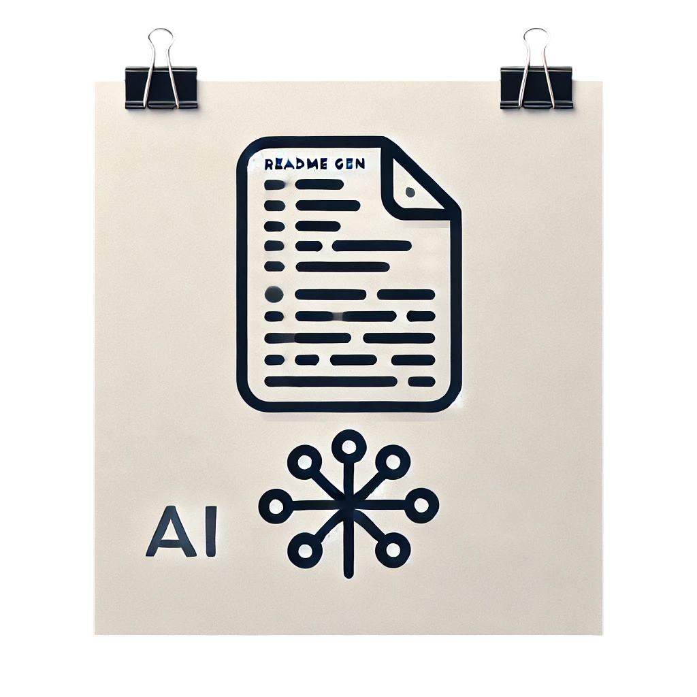

 

  

  <h3 align="center">README Generator</h3>

  

    An awesome README generator to jumpstart your projects!
     
    <a href="https://github.com/bizkwit/readme-gen/issues/new?labels=bug&template=bug-report---.md">Report Bug</a>
    ·
    <a href="https://github.com/bizkwit/readme-gen/issues/new?labels=enhancement&template=feature-request---.md">Request Feature</a>
  

## Overview

This project provides a Gradio-based web application that leverages Google's Gemini AI model to generate comprehensive README files for GitHub repositories.  Users input a GitHub repository URL, a project description, and optionally a personal access token (for private repositories), and the application automatically clones the repository, analyzes the code, and generates a detailed README.md file using the LLM.  The generated README adheres to a template ensuring consistency and completeness.

## Table of Contents

- [Features](#features)
- [Technologies](#technologies)
- [Getting Started](#getting-started)
- [Examples](#examples)
- [Roadmap](#roadmap)
- [Contributing](#contributing)
- [License](#license)

## Features

* **Automated README Generation:**  Generates a structured and informative README.md file based on code analysis and project description.
* **Support for Private Repositories:** Accepts personal access tokens to clone and process private GitHub repositories.
* **LLM-Powered Content Generation:** Utilizes Google's Gemini AI model for high-quality and detailed README content.
* **User-Friendly Interface:** Provides a simple and intuitive Gradio interface for easy use.
* **Template-Based Generation:** Uses a template to ensure consistent structure and sections in the generated README.
* **Error Handling:** Includes robust error handling for various scenarios, such as invalid repository URLs, cloning failures, and code analysis issues.

## Technologies

* 
* 
* 
* 
* 

## Getting Started

**Prerequisites:**

* Python 3.x
* `pip install -r requirements.txt`

**Installation:**

1. Clone the repository: `git clone https://github.com/bizkwit/readme-gen.git`
2. Navigate to the project directory: `cd readme-gen`
3. Install dependencies: `pip install -r requirements.txt`
4. Set up your Google Cloud API key and save it in a `.env` file as `GOOGLE_API_KEY`

**Usage:**

1. Run the application: `python main.py`
2. Access the Gradio interface in your browser (usually at `http://0.0.0.0:7860`).
3. Enter the GitHub repository URL and a project description.
4. For private repositories, provide your GitHub personal access token.
5. Click "Generate README".

## Examples

You can find example usage in the [examples](examples) directory.

## Roadmap

- [x] Basic README generation functionality
- [x] Gradio UI implementation
- [x] Private repository support
- [x] Improved error handling
- [ ] Add more robust code analysis capabilities
- [ ] Implement a more sophisticated template system
- [ ] Integrate with GitHub Actions for automated README updates

## Contributing

Contributions are welcome! Please see the [CONTRIBUTING.md](CONTRIBUTING.md) file for details.

## License

This project is licensed under the MIT License - see the [LICENSE](LICENSE) file for details.